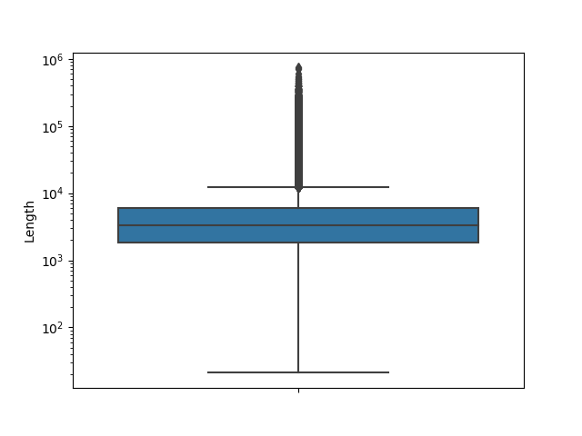

# Detalles técnicos

## Despliegue

Para poder desplegar en los servidores de Wikipedia, hay que forzar el contexto con el nombre de la herramienta y el puerto para sortear el proxy. Esto se configura en el archivo `application.yml`:
```
server:
  port: 8000
  servlet.context-path: /replacer/
```

Al empaquetar, el frontend se compila con el contexto de la herramienta `--baseHref /replacer/`, se incluye en el WAR y por tanto se despliega junto con el backend en https://tools.wmflabs.org/replacer/.

En local por tanto se despliega en http://localhost:8000/replacer/. El frontend se despliega con `--port 8080` para cuadrar con la dirección de vuelta de la autenticación y por tanto lo hace en http://localhost:8080. En `environment.ts` apuntamos al backend local.

## Autenticación

La autenticación se realiza mediante el protocolo Oauth 1.0a contra la API de Wikimedia, lo que permite utilizar la aplicación con los mismos usuarios con los que editamos normalmente en Wikipedia. Por seguridad, se implementa la autenticación en el backend, y el frontend solo contendrá el último token de acceso.

La dirección de vuelta tras autenticar, si se usan los tokens de Producción, es la de inicio: https://tools.wmflabs.org/replacer/. En cambio, si se usan los tokens de desarrollo, la dirección de vuelta tras autenticar es http://localhost:8080/.

## Wikipedia API

La herramienta no precisa de muchas llamadas distintas a la API de la Wikipedia, principalmente recuperar el contenido de una página y editarlo. Aunque hay librerías que lo facilitan, como [Mediawiki-Japi](https://github.com/WolfgangFahl/Mediawiki-Japi), no permiten la autenticación con Oauth por lo que el autor de las ediciones no quedaría reflejado.

Por tanto he decidido implementar todas las llamadas dentro de la propia herramienta, que irán firmadas con el token OAuth, incluso las de lectura.

## Nomenclatura

- *Page*: Cada una de las páginas de la Wikipedia: artículos, discusiones, anexos, usuarios, plantillas, etc.
- *Namespace*: espacio de nombres que determina el tipo de página: artículo (`0`), anexo (`104`), etc.
- *Article*: artículo de la Wikipedia, i. e. página en el _namespace_ de artículos.
- *Replacement*: potencial reemplazo, e. g. el término «habia» debe reemplazarse con «había», y el término «entreno» es candidato a reemplazarse con «entrenó» o en cambio ser correcto.
- *Ignored Replacement*: porción de un artículo que no se tiene en cuenta para buscar los reemplazos, e. g. las frases entrecomilladas.
- *Dump*: ficheros generados mensualmente con toda la información en la Wikipedia. El que usa esta herramienta es un XML enorme (~13 GB, ~3 GB comprimidos) con todos los artículos de la Wikipedia.

## Banco de pruebas

El número de páginas de la Wikipedia en español es inmenso (más de 6 millones), de las cuales prácticamente la mitad son artículos:


A la hora de indexar los artículos para encontrar reemplazos, es fundamental optimizar los algoritmos o expresiones regulares utilizados.

Para las pruebas de rendimiento, se han extraído estadísticas sobre la longitud de los artículos:

|     |             |
|-----|-------------|
|count|   3226779.00|
|mean |      2728.26|
|std  |      7971.68|
|min  |        14.00|
|25%  |        34.00|
|50%  |        56.00|
|75%  |      2931.00|
|max  |    740469.00|

Los datos no son normales (en el sentido estadístico de que no siguen la distribución normal). Si dibujamos el diagrama de caja y bigote (con escala logarítmica) vemos que los artículos con más de 10.000 caracteres son casos puntuales.



Para hacer las pruebas de los distintos algoritmos, tomaremos 99 artículos de forma aleatoria (aunque no podamos aplicar el TCL y suponer que la muestra mantiene la distribución original), e incluiremos también el más largo. Ejecutaremos cada uno de los algoritmos repetidas veces y compararemos los tiempos.

Para los algoritmos con expresiones regulares, he tenido en cuenta dos tipos de motores de expresiones regulares: _regex-directed_ y _text-directed_. El primero es el que viene con las librerías de Java y que contiene todas las características interesantes: _look-ahead_, _look-behind_, _lazy_, _possessive_, _back-references_, etc.
El segundo es más limitado en sintaxis pero a cambio ofrece un rendimiento lineal, logrando en algunos casos un rendimiento muy superior.

## Excepciones

Hay ciertas partes de un texto que queremos ignorar pues se suelen detectar muchos falsos positivos, por ejemplo una cita en español antiguo o un parámetro propio de la Wikipedia que no acepta diacríticos:
* Comentarios HTML: `<!-- españa -->`
* Nombres de archivos: `[[File:españa.png|España]]`
* Parámetro índice: `{{... | índice = españa | ...}}`
* Cursiva, negrita y entrecomillados: `''online''`, `'''Lopez'''`,
 `"In Paris"`, `«In Paris»`, `“In Paris”` 
* Código fuente (`source`, `syntaxhighlight` y `math`): `<math>LaTeX</math>`
* Nombres de plantillas: `{{Album | ...}`
* Parámetros: `{{ ... | pais = España | ... }}`
* Plantillas completas: `ORDENAR`, `DEFAULTSORT`, `NF`, `Cita`, `Quote`,
 ` Coord`, `Commonscat`
* Categorías: `[[Categoría:Jennifer Lopez]]` 
* URL: `http://www.jenniferlopez.com`
* Etiquetas XML: `<ref name="españa">`

## Errores ortográficos

Los errores ortográficos o _misspellings_ son posibles faltas de ortografía se extraen del artículo «Wikipedia:Corrector_ortográfico/Listado».

Se omiten los términos del listado que contienen números o puntos, puesto que éstos ya serán tratados en un buscador distinto enfocado exclusivamente en unidades de medida.

### Excepciones

* Términos que suelen ser un nombre propio de persona: Julio, Frances, etc.
* Términos que deben escribirse en minúscula salvo cuando la puntuación lo exija.

### Algoritmo

Para buscar errores ortográficos, he planteado varias pruebas. Primero cargar todos los posibles errores del listado y buscarlos en el texto. Luego al revés buscar todas las palabras del texto y ver si son errores.

Dado que manejamos casi 20.000 errores distintos, la segunda opción es muchísimo más eficiente (unas 100 veces de media) así que me centro en comparar las distintas pruebas para este segundo método, donde comprobamos que la búsqueda de palabras con una expresión regular _text-directed_ es la mejor (la siguiente opción tarda el doble).


## Indexación

El sistema comprueba semanalmente el último _dump_ generado y lo procesa, esto es, lee uno a uno los artículos, busca los potenciales reemplazos y los añade a la base de datos.

El proceso de indexación tiene dos partes principales: la lectura de cada uno de los artículos y el procesado de los artículos (si procede):

- Solo se procesan los contenidos de tipo «Artículo» o «Anexo».
- Se procesan los artículos ya indexados para tener en cuenta nuevas excepciones o potenciales reemplazos.
- No se procesan los artículos ya revisados manualmente.
- Hay una opción para forzar y reindexarlo todo, incluso los artículos revisados.

El sistema además ofrece una sección para comprobar el estado de la indexación en tiempo real.

### Optimizaciones

En cuanto a la lectura de los artículos del _dump_ no hay optimización posible.
La lectura de un XML es mucho más rápida que de un XML comprimido (estimo que unas 10 veces) pero en la máquina de Wikipedia solo tenemos la opción de usar la versión comprimida.

En cuanto al procesado de los artículos, también tenemos 3 partes claras:
1. Consultar la BD para ver si el artículo ya existe y cuál es su estado.
El sistema busca varios (1000) artículos a la vez para reducir el número de llamadas a BD.
2. Buscar los errores potenciales y descartar los contenidos en excepciones.
El sistema intenta terminar lo antes posible en el caso de no encontrar errores potenciales.
3. Guardar en BD los reemplazos detectados en el artículo. El sistema intenta realizar solo las inserciones, borrados y actualizaciones necesarias.

La herramienta puede llegar a procesar más de un millón de artículos, con lo cual el uso de memoria por parte de JPA no para de crecer. Para evitarlo se ha eliminado la relación _one-to-many_ entre artículos y reemplazos (aunque se mantiene la clave ajena en la BD), y cada cierto número de artículos procesados se limpia el gestor JPA (_flush-clear_). Con esto conseguimos mantener a raya el _heap_ de la JVM.
