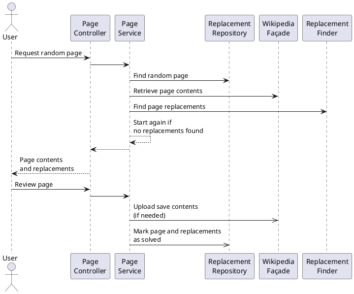
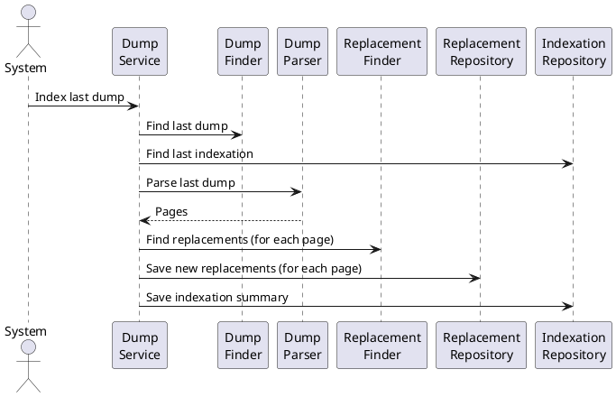
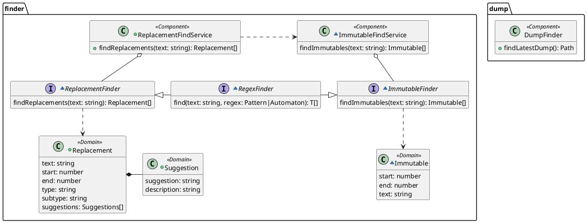

# Technical Design

The purpose of this project is to provide a web tool in order to find and fix common orthography and style issues in Wikipedia pages.

The project started to work with Spanish Wikipedia, but it is meant to be extended to work with other languages or Wikimedia projects.

Main use cases:

1. As a user, I want to request a random Wikipedia page containing potential issues to fix, in order to review them, discard the false positives and save the approved fixed into Wikipedia.
2. As a system, I want to find all the existing issues in Wikipedia pages, in order to find quickly a page for the previous use case.

The following concepts are used:

- **Page** A page in Wikipedia. It is composed at least by the following properties:
  - **Type** (or **namespace**) The category of the page in Wikipedia: articles, annexes, user pages, etc. Note that, as an article is a specific type of page, it should not be used as a synonym of page.
  - **Title** The title of the page identifies it uniquely.
  - **ID** The ID of the page is a number for internal use that can also be used to identify uniquely a page.
  - **Contents** The current text contents of the page.
  - **Timestamp** The date and time of the last update of the page.
- **Dump** A huge XML file, generated monthly, containing all the current Wikipedia pages.
- **Replacement** A potential issue to be checked and fixed (replaced). For instance, the word _aproximated_ is misspelled and therefore could be proposed to be replaced with _approximated_.

  Note the importance of the _potential_ adjective, as an issue could be just a false positive. For instance, in Spanish the word _Paris_ could be misspelled if it corresponds to the French city (written correctly as _París_), but it would be correct if it refers to the mythological Trojan prince.

  A replacement is composed by:

  - **Text** The text to be checked and fixed. It can be a word or an expression.
  - **Start** A number corresponding to the position in the page contents where the text is found. Take into account that the first position is 0.
  - **Type** The category of the replacement: misspelling, date format, etc. It may include a **SubType**, for instance the particular misspelling.
  - **Suggestions** A list with at least one suggestion to replace the text. Each suggestion is composed by:
    - **Text** The new text after the replacement.
    - **Comment** An optional description to explain the motivation of the fix.
- **Immutable** A section in the page contents to be left untouched, for instance a literal quote, so any replacement found within it must be ignored and not offered to the user for revision. It is composed by:
  - **Start** The start position of the section in the page contents
  - **End** The end position of the section in the page contents
  - **Text** Optionally, the text in the section, especially for debugging purposes, i. e. the text between the start and end position of the section.
- **Cosmetic** A special type of replacement which can be applied automatically, concerning cosmetic modifications, visible or not, e. g. replacing `[[Asia|Asia]]` by `[[Asia]]`.

For the first use case, the basic steps are:

1. Find in the database a page containing at least a replacement
2. Find in Wikipedia the last version of the page contents as the information in the database could be outdated
3. Parse the page contents and find all the replacements in the page
4. Display to the user the current page contents and all the found replacements
5. The user discards some replacements and accepts the suggestions for others
6. The replacements accepted by the user are applied to the page contents and uploaded to Wikipedia

For the second use case:

1. Find latest dump
2. Parse the dump and extract the pages. For each page:
    1. Parse the page to find the replacements
    2. Save the page replacements in the database
3. Save a summary of the process in the database

## Component Overview

### DumpFinder

The dumps are generated monthly and placed in a shared folder in Wikipedia servers. This _dump base folder_ is structured in sub-folders corresponding to the different wiki-projects, e. g. `eswiki`, which are also structured in sub-folders for each generation date, e. g. `20120120`, containing finally the dump files. For instance:

- `/public/dumps/public`
  - `enwiki`
  - `eswiki`
    - `20200101`
      - `eswiki-20200101-pages-articles-multistream.xml.bz2`
      - `eswiki-20200101-pages-articles.xml.bz2`
      - …
    - `20191220`
    - `20191201`
    - …
  - `eswikibooks`
  - …

The path of the shared folder and the wiki-project ares configured externally.

## Find Replacements

The core functionality of the tool is to find all potential _replacements_ in a text. We want also to find all the _immutables_ in this text, in order to be able to avoid as many false positives as possible. This operation will be performed millions of times when indexing a whole dump, therefore the performance is critical.

In package _finder_ there are services (**finders**) to find all the relevant items in a text: **ReplacementFindService**, **ImmutableFindService** and **CosmeticFindService**. The same way, there are specific interfaces for each item type to be implemented by the finders: **ReplacementFinder**, **ImmutableFinder** and **CosmeticFinder**. Each service will load all finders implementing the related interface, and execute these finders against the given text, returning finally all the results.

When possible, the results will be returned as an _Iterable_. This way, we have the possibility to stop finding more results, improving the performance. For instance, when finding immutables to ignore found replacements, if there are no more replacements left in the text, there is no point on finding more immutables. The class **IterableOfIterable** helps traverse an iterable composed of iterables, e. g. a list of lists.

Several finders are based on regular expressions. The class **RegexIterable**\<T\> provides a generic method to find all results from a given regular expression and return them as an iterable. The constructor needs a function to convert the generic _MatchResult_ into the desired item type _T_. Optionally, we can provide a function to validate the result against the text, e. g. to check if it is a complete word.

The same way, several (optimized) finders are based in a linear strategy, finding results in the text with `indexOf` and similar.

Finally, the helper class **FinderUtils** provides static methods to work with words and characters in a text.

### Immutable Finders

Generic immutable finders are placed in package _finder.immutable_ and implement the interface _ImmutableFinder_. They must have the Spring annotation _@Component_ in order to be found dynamically by the system.

The tool implements the following generic immutable finders. We can add a priority to the immutable finders, as some immutables are more _useful_ than others and we want them to be used before.
- **CompleteTagFinder** Find some XML tags and all the content within, even other tags, e. g. `<code>An example.</code>`. The list of tags is configured in `complete-tags.xml`. Even with several tags taken into account, the faster approach is the linear search in 1 pass.
- **TemplateParamFinder** Find template parameters, e. g. `param` in `{{Template|param=value}}`. For some specific parameters, we include in the result also the value, which is usually a taxonomy, a Commons category, etc. Finally, we include also the value if it seems like a file or a domain.
- **LinkAliasedFinder** Find the first part of aliased links, e. g. `brasil` in `[[brasil|Brasil]]`
- **CursiveFinder** Find text in cursive, e. g. `''cursive''` in `This is a ''cursive'' example`
- **QuotesFinder**, **QuotesTypographicFinder** and **QuotesAngularFinder** Find text in quotes, e. g. `"text"`, `“text”` or `«text»`
- **UrlFinder** Find URLs, e. g. `https://www.google.es`
- **FileNameFinder** Find filenames, e. g. `xx.jpg` in `[[File:xx.jpg]]`

- [ ] **XmlTagFinder** Find XML tags, e. g. `` or ` `
- [ ] **CommentFinder** Find XML comments, e. g. `<!-- A comment -->`
- [ ] **CategoryFinder** Find categories, e. g. `[[Categoría:España]]`
- [ ] **TemplateNameFinder** Find template names, e. g. `Bandera` in `{{Bandera|España}}`
- [ ] **TemplateFinder** Find some complete templates, even with nested templates, e. g. `{{Cite|A cite}}`
- [ ] **LinkSuffixedFinder** Find links with suffix, e. g. `[[brasil]]eño`
- [ ] **InterLanguageLinkFinder** Find inter-language links, e. g. `[[:pt:Title]]`

### Misspelling finders

Package _finder.misspelling_ includes replacement and immutable finders related with misspellings.

- [ ] **MisspellingSimpleFinder** Find misspellings with only word, e. g. `habia` in Spanish
- [ ] **MisspellingComposedFinder** Find misspellings with more than one word, e. g. `aún así` in Spanish

- [ ] **PersonNameFinder** Find person names which are used also as nouns and thus are false positives, e. g. in Spanish `Julio` in `Julio Verne`, as "julio" is also the name of a month to be written in lowercase.
- [ ] **FalsePositiveFinder** Find known expressions which are (almost) always false positives, e. g. in Spanish `aun así` which hides the potential replacement `aun`
- [ ] **UppercaseAfterFinder** Find words in uppercase which are correct according to the punctuation, e. g. `Enero` in `{{Cite|date=Enero de 2020}}`

### Date Finders

Package _finder.date_ includes replacement finders related with dates.

- [ ] **LeadingZeroFinder** Find long dates starting with zero, e. g. `02 de septiembre de 2019`
- [ ] **UppercaseMonthFinder** Find dates with the month in uppercase, e. g. `2 de Septiembre de 2019`
- [ ] **UppercaseMonthWithoutDayFinder** Find months in uppercase without day and after a common preposition, e. g. `desde Septiembre de 2019`

### Cosmetic Finders

Cosmetic finders are placed in package _finder.cosmetic_ and implement the interface _CosmeticFinder_. The must have the Spring annotation _@Component_ in order to be found dynamically by the system.

The tool implements the following generic cosmetic finders:

- **SameLinkFinder** Find links where the alias matches with the target link and thus the alias can be removed, e. g. `[[Madrid|Madrid]]`

This finders are used after a user reviews a replacement so the performance is not so important as when finding replacements and immutables.

### Benchmarks

Package _finder.benchmark_ contains subpackages for each finder with different implementations in order to test the results and performance, and choose the best one.

To work with regular expressions, the implementation included in Java is _regex-based_, which is the standard containing advanced features like look-ahead, look-behind, references, etc.

On the other hand, this tool uses also a _text-based_ implementation. It builds an automaton from the regex and gives impressive performance improvements of 1 to 2 orders of magnitude for simple expressions. However, it doesn't include advanced features implying backtracking.

Also, if the complexity is not too high, we try a simpler _linear_ approach finding strings in the text without regular expressions, char by char, which usually gives even better results, about 5 times faster.

In benchmarks, we usually compare a dot-plus with a negated character. In general, no big differences have been found between both, although the times with the negated character class are slightly better, so this last one is preferred.

In conclusion, as performance is critical, we try to use the faster implementation when possible, except if the complexity of the finder makes worth to use an automaton or a regular expression.

## TODO: REVIEW COMPONENTS

- [x] `dump.DumpFinder`
- [x] `finder.ReplacementFindService`
- [ ] Page Controller
- [ ] Page Service
- [ ] Replacement Repository
- [ ] Wikipedia Façade
- [ ] Dump Service
- [ ] Dump Parser
- [ ] Indexation Repository

## TODO: ROADMAP

### Optimization
- [ ] Optimize regex for all replacement/immutable finders
- [ ] Research to improve the database model
- [ ] Research the immutables more commonly applied in order to give them some kind of priority
- [ ] Check if it is worth to find as immutables some templates like `Cita web` as most of them should be captured by the complete tag `ref`
- [ ] \#71: Performance tests to run replacement finders in parallel
- [ ] \#79: Add some kind of warning for heavy indexations in order to find issues in finder performance
- [ ] Delete replacements reviewed by the system which are not needed to keep track of the reviewed articles. For the moment, I do it manually by running the query: `DELETE FROM replacement2 WHERE reviewer = 'system' AND position > 0;`

### Features
- [ ] \#102: Try to copy the fat-jar out of the project folder in order to package it while still running
- [ ] \#111: Check if an article is blocked. Try to do it also in pywikibot.
- [ ] Research in MediaWiki code to apply Spanish date format in references
- [ ] \#45: Research exceptions for the most common replacements
- [ ] Check if it is worth to store the replacement type as an enumerate
- [ ] Research if it is possible to deploy independently the frontend and the backend in ToolLabs
- [ ] Adapt unit tests to JUnit5
- [ ] Research how to enable/disable replacement/immutable finders by language
- [ ] Review in the bot, in case they exist, possible cases of the template `dts` or `date_table_sorting` with English format, as this template also exists in Spanish. See <https://en.wikipedia.org/wiki/Template:Date_table_sorting>, <https://es.wikipedia.org/wiki/Plantilla:Dts>, <https://es.wikipedia.org/w/index.php?title=Compile_Heart&diff=prev&oldid=122078489>.
- [ ] Make the tool more general in order to find replacements in other wiki-projects

### Docs
- [ ] Publish the rules of BenjaBot
- [ ] Review the managers for misspellings and false-positives, and remark the Observable pattern.
- [ ] Complete the rest of the technical design
- [ ] The Java code is formatted with [Prettier Java](https://github.com/jhipster/prettier-java)
- [ ] The Java code has been migrated Java 11. The only issue is the tests with @DataJpaTest so they have been disabled, but it seems a problem of Spring/JDK itself, so it is not worth to investigate more.
