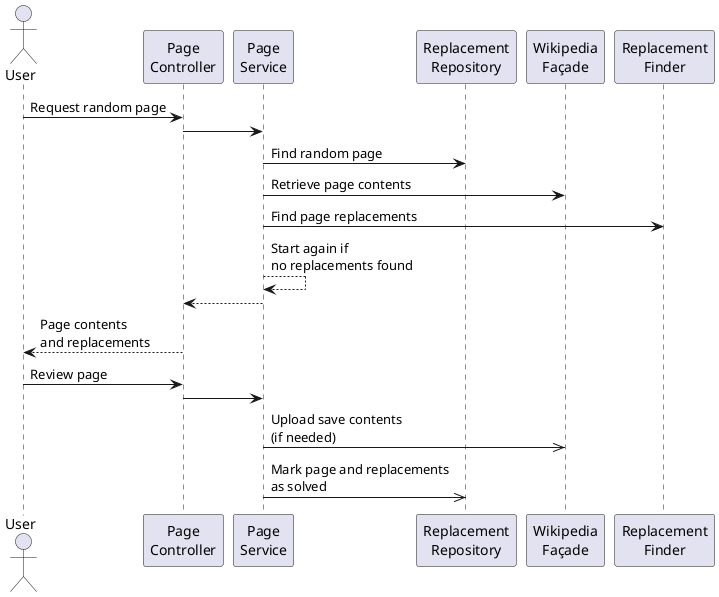
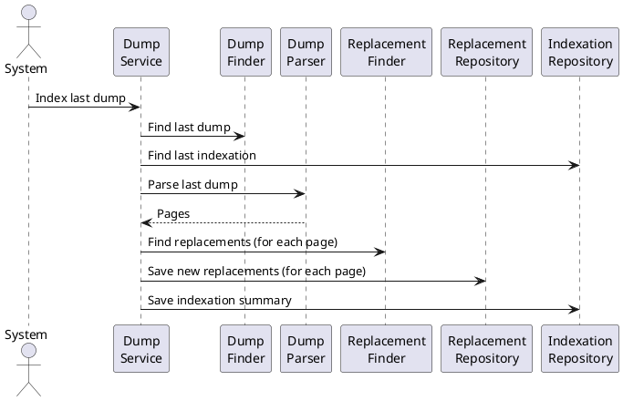

# Technical Design

The purpose of this project is to provide a web tool in order to find and fix common orthography and style issues in Wikipedia pages.

The project started to work with Spanish Wikipedia, but it is meant to be extended to work with other languages or Wikimedia projects.

Main use cases:

1. As a user, I want to request a random Wikipedia page containing potential issues to fix, in order to review them, discard the false positives and save the approved fixed into Wikipedia.
2. As a system, I want to find all the existing issues in Wikipedia pages, in order to find faster a page for the previous use case.

The following concepts are used:

- **Page** A page in Wikipedia. It is composed at least by the following properties:
  - **Type** (or **namespace**) The category of the page in Wikipedia: articles, annexes, user pages, etc. Note that, as an article is a specific type of page, it should not be used as a synonym of page.
  - **Title** The title of the page identifies it uniquely.
  - **ID** The ID of the page is a number for internal use that can also be used to identify uniquely a page.
  - **Contents** The current text contents of the page.
  - **Timestamp** The date and time of the last update of the page.
- **Dump** A huge XML file, generated monthly, containing all the current Wikipedia pages.
- **Replacement** A potential issue to be checked and fixed (replaced). For instance, the word _aproximated_ is misspelled and therefore could be proposed to be replaced with _approximated_.
  
  Note the importance of the _potential_ adjective, as an issue could be just a false positive. For instance, in Spanish the word _Paris_ could be misspelled if it corresponds to the French city (written correctly as _París_), but it would be correct if it refers to the mythological Trojan prince.
  
  A replacement is composed by:

  - **Text** The text to be checked and fixed. It can be a word or an expression.
  - **Start** A number corresponding to the position in the page contents where the text is found. Take into account that the first position is 0.
  - **Type** The category of the replacement: misspelling, date format, etc. It may include a **SubType**, for instance the particular misspelling.
  - **Suggestions** A list with at least one suggestion to replace the text. Each suggestion is composed by:
    - **Text** The new text after the replacement.
    - **Comment** An optional description to explain the motivation of the fix.
- **Immutable** A section in the page contents to be left untouched, for instance a literal quote, so any replacement found within it must be ignored and not offered to the user for revision. It is composed by:
  - **Start** The start position of the section in the page contents
  - **End** The end position of the section in the page contents
  - **Text** Optionally, the text in the section, especially for debugging purposes, i. e. the text between the start and end position of the section.

For the first use case, the basic steps are:

1. Find in the database a page containing at least a replacement
2. Find in Wikipedia the last version of the page contents as the information in the database could be outdated
3. Parse the page contents and find all the replacements in the page
4. Display to the user the current page contents and all the found replacements
5. The user discards some replacements and accepts the suggestions for others
6. The replacements accepted by the user are applied to the page contents and uploaded to Wikipedia



For the second use case:

1. Find latest dump
2. Parse the dump and extract the pages. For each page:
    1. Parse the page to find the replacements
    2. Save the page replacements in the database
3. Save a summary of the process in the database



## Component Overview

```plantuml
@startuml
package dump {
    class DumpFinder << Component >> {
        +findLatestDump(): Path
    }
}

package finder {
    class ReplacementFindService << Component >> {
        +findReplacements(text: string): Replacement[]
    }
    interface ReplacementFinder {
        +findReplacements(text: string): Replacement[]
    }
    class Replacement << Domain >> {
        text: string
        start: number
        end: number
        type: string
        subtype: string
        suggestions: Suggestions[]
    }
    class Suggestion << Domain >> {
        suggestion: string
        description: string
    }

    class ImmutableFindService << Component >> {
        +findImmutables(text: string): Immutable[]
    }
    interface ImmutableFinder {
        +findImmutables(text: string): Immutable[]
    }
    class Immutable << Domain >> {
        start: number
        end: number
        text: string
    }

    interface RegexFinder<T> {
        +find(text: string, regex: Pattern|Automaton): T[]
    }
}

ReplacementFindService o-- ReplacementFinder
ReplacementFinder ..> Replacement
ImmutableFindService o-- ImmutableFinder
ImmutableFinder ..> Immutable
ReplacementFindService ..> ImmutableFindService
Replacement *-- Suggestion
RegexFinder<T> --> ReplacementFinder
RegexFinder<T> --> ImmutableFinder

hide empty members
@enduml
```

### DumpFinder

The dumps are generated monthly and placed in a shared folder in Wikipedia servers. This _dump base folder_ is structured in sub-folders corresponding to the different wiki-projects, e. g. `eswiki`, which are also structured in sub-folders for each generation date, e. g. `20120120`, containing finally the dump files. For instance:

- `/public/dumps/public`
  - `enwiki`
  - `eswiki`
    - `20200101`
      - `eswiki-20200101-pages-articles-multistream.xml.bz2`
      - `eswiki-20200101-pages-articles.xml.bz2`
      - …
    - `20191220`
    - `20191201`
    - …
  - `eswikibooks`
  - …

The path of the shared folder and the wiki-project ares configured externally.

### ReplacementFindService

**ReplacementFindService** is an independent service which finds all the replacements in a given text. This service collects and returns the results of several specific replacement finders: misspelling, date format, etc. which implement the same interface **ReplacementFinder**.

The same way, there is an independent service **ImmutableFindService** which finds all the immutables in a given text. This service collects and returns the results of several specific immutable finders: quotes, comments, hyperlinks, etc. which implement the same interface **ImmutableFinder**.

Finally, _ReplacementFindService_ ignores in the response all the found replacements which are contained in the found immutables. Usually there will be much more immutables found than replacements. Thus it is better to obtain first all the replacements, and then obtain the immutables one by one, aborting in case the replacement list gets empty. This way we can avoid lots of immutable calculations.

The interface _ImmutableFinder_ has a single abstract method returning the immutables in a text. As we are interested in retrieve them one by one, they will be returned as an _Iterable_. On the other hand, the interface _ReplacementFinder_ has a single abstract method returning the replacements in a text, as a list, as all the replacements will be eventually joined into a list.

Most finders find the items with regular expressions. Thus we create an generic class _RegexFinder\<T\>_ with methods to find all the match results of a regex and transform them into the type _T_, where _T_ will be _Replacement_ or _Immutable_. For simplicity, finally this class will be implemented as an interface with default methods that will be extended by the interfaces _ReplacementFinder_ and _ImmutableFinder_.

## TODO: REVIEW COMPONENTS

- [x] `dump.DumpFinder`
- [ ] Replacement Finder
- [ ] Page Controller
- [ ] Page Service
- [ ] Replacement Repository
- [ ] Wikipedia Façade
- [ ] Dump Service
- [ ] Dump Parser
- [ ] Indexation Repository

## TODO: OPTIMIZATION

- [ ] After 1-Mar-2020 the _page-articles_ dumps will be generated both in multi-stream mode but in different ways (cf. <https://phabricator.wikimedia.org/T239866>). We should check if any of them is read/parsed faster.
- [ ] Research how to enable/disable replacement/immutable finders by language
- [ ] Optimize regex for all replacement/immutable finders
- [ ] Research to return the immutables as a stream or iterator. Research also the immutables more commonly applied in order to give them some kind of priority.
- [ ] Performance tests to run replacement finders in parallel
- [ ] Check if it is worth to store the replacement type as an enumerate
