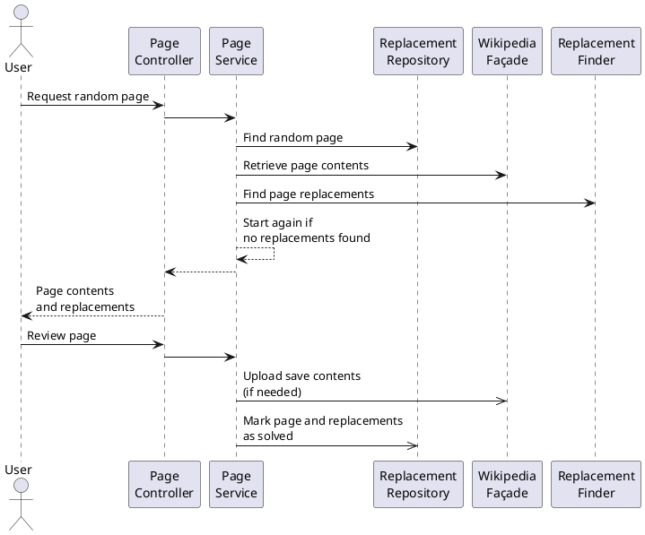
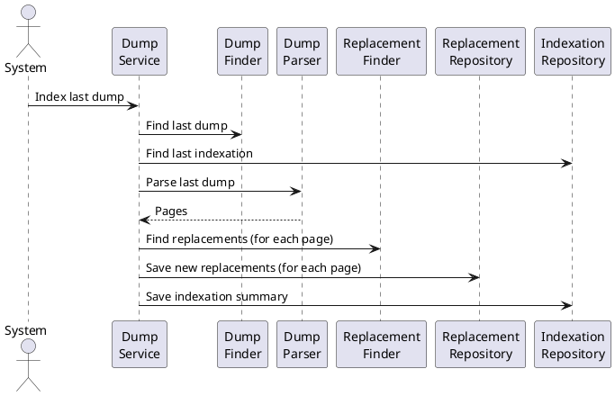

# Technical Design

The purpose of this project is to provide a web tool in order to find and fix common orthography and style issues in Wikipedia pages.

The project started to work with Spanish Wikipedia, but it is meant to be extended to work with other languages or Wikimedia projects.

Main use cases:

1. As a user, I want to request a random Wikipedia page containing potential issues to fix, in order to review them, discard the false positives and save the approved fixed into Wikipedia.
2. As a system, I want to find all the existing issues in Wikipedia pages, in order to find faster a page for the previous use case.

The following concepts are used:

- **Page** A page in Wikipedia. It is composed at least by the following properties:
  - **Type** (or **namespace**) The category of the page in Wikipedia: articles, annexes, user pages, etc. Note that, as an article is a specific type of page, it should not be used as a synonym of page.
  - **Title** The title of the page identifies it uniquely.
  - **ID** The ID of the page is a number for internal use that can also be used to identify uniquely a page.
  - **Contents** The current text contents of the page.
  - **Timestamp** The date and time of the last update of the page.
- **Dump** A huge XML file, generated monthly, containing all the current Wikipedia pages.
- **Replacement** A potential issue to be checked and fixed (replaced). For instance, the word _aproximated_ is misspelled and therefore could be proposed to be replaced with _approximated_.
  
  Note the importance of the _potential_ adjective, as an issue could be just a false positive. For instance, in Spanish the word _Paris_ could be misspelled if it corresponds to the French city (written correctly as _París_), but it would be correct if it refers to the mythological Trojan prince.
  
  A replacement is composed by:

  - **Text** The text to be checked and fixed. It can be a word or an expression.
  - **Start** A number corresponding to the position in the page contents where the text is found. Take into account that the first position is 0.
  - **Type** The category of the replacement: misspelling, date format, etc.
  - **Suggestions** A list with a least one suggestion to replace the text. Each suggestion is composed by:
    - **Suggestion** The new text after the replacement.
    - **Description** An optional description to explain the motivation of the fix.
- **Immutable** A section in the page contents to be left untouched, for instance a literal quote, so any replacement found within it must be ignored and not offered to the user for revision. It is composed by:
  - **Start** The start position of the section in the page contents
  - **End** The end position of the section in the page contents
  - **Text** Optionally, the text in the section, especially for debugging purposes, i. e. the text between the start and end position of the section.

For the first use case, the basic steps are:

1. Find in the database a page containing at least a replacement
2. Find in Wikipedia the last version of the page contents as the information in the database could be outdated
3. Parse the page contents and find all the replacements in the page
4. Display to the user the current page contents and all the found replacements
5. The user discards some replacements and accepts the suggestions for others
6. The replacements accepted by the user are applied to the page contents and uploaded to Wikipedia

For the second use case:

1. Find latest dump
2. Parse the dump and extract the pages. For each page:
    1. Parse the page to find the replacements
    2. Save the page replacements in the database
3. Save a summary of the process in the database

